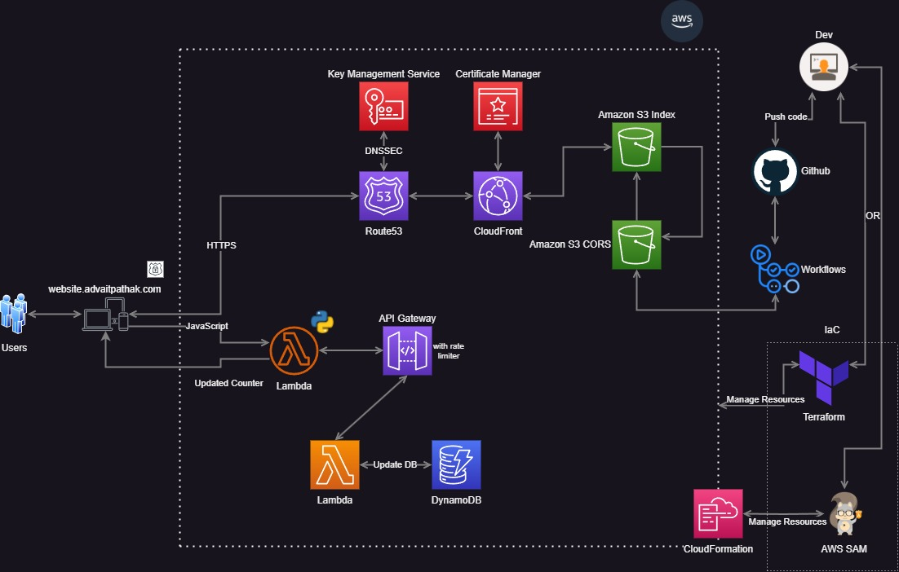

# Resume on the Cloud

## Chunk 1

1. Project Setup
    - Setup the AWS root account and AWS CLI on your machine.
    - Create user with full S3 access in IAM.
    - Create another user with Admin access in IAM for IaC using AWS SAM or Terraform.

## Chunk 2

2. HTML + S3 config
    - Create your website/resume using HTML/CSS/JS.
    - Create a new `S3 bucket`, upload the website on the S3 bucket.
    - Configure s3 to `host static website, allow public access, change bucket policy` for anyone to gets3object.

3. CloudFront
    - Create a new CF Distribution
    - Use the above S3 `static website link` as the `origin ID`.
    - Set `origin link` to `http-only`

4. Route53
    - Buy your own domain on Route53
    - After hosted zones are populated, create a new certificate in ACM, add the records to Route53
    - Add an `A record` in Route53 pointing to our CFD endpoint.
    - Add the `A record` as an `Alternate domain website` to our CFD.
    - Set `viewer link` to `redirect from http to https`, origin link to `https or whatever works`

####  We should be live now on our custom website (A record)!

5. Setup CORS
    - Create a new S3 bucket for the static files of our website (images, js, css)
    - Enable static website hosting, update CORS Policy
    - While uploading to this bucket, `Grant public access` to the files.
    - Make sure the files are accessible on the internet.
    - Update your index.html from the local links to these s3 bucket links.
    

<h3> To-do </h3>

1. [x] Add the whole infrastructure diagram
2. [x] Synopsys of the whole process (Chunk wise)
3. [ ] Explanation of the Security Mods
4. [ ] Add the terraform model
